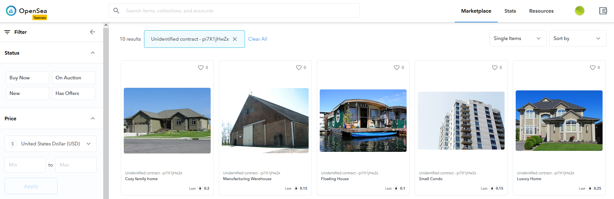
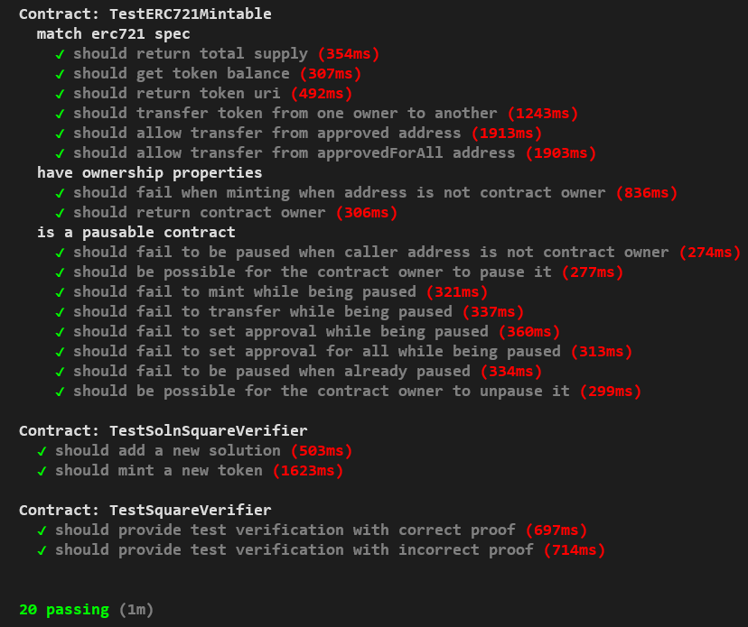

# Udacity Blockchain Capstone

This repository contains the Udacity Capstone Project for the Udacity's Blockchain Developer Nanodegree Program. The project deals with the creation of a decentralized house listing service, combining the use of ERC-721 Non Fungible Tokens (NFTs) with Succint Zero-Knowledge proofs (zk-SNARKs). 

## Project tasks overview

Comprising the project are the following tasks:
- Writing the main functions of the ERC721Mintable Smart Contract
- Implementing the zk-SNARKs solution using the ZoKrates toolbox
- Creating a Smart Contract that inherits from the ERC721Mintable and calls the verifier.sol Smart Contract from ZoKrates
- Testing functionalities of all three Smart Contracts
- Deploying the project to the Rinkeby Network and minting 10 tokens
- Listing the tokens in the OpenSea marketplace and making a purchase of 5 of them from another account



### Smart Contract and OpenSea Storefront data

The data of the deployed Smart Contracts (Contract Addresses and Contract Abi's) and the OpenSea MarketPlace Storefront link can be found in the following file:

[Contract Data and Marketplace Storefront link](ContractData.md)


## Interacting with the SolnSquareVerifier Smart Contract

In order to mint ERC-721 tokens using the zk-SNARKs functionality a Smart Contract called `SolnSquareVerifier` is created.

### Interfaces with other Smart Contracts

This Smart Contract inherits from the `DigitalPropertyToken` Smart Contract, which contains the ERC-721 Mintable token functions. 

```
contract SolnSquareVerifier is DigitalPropertyToken
```

At the same time, in the `mintNFT()` function, it makes a call to the contract generated by ZoKrates in order to verify the validity of the proof being provided for the new token.

```
bool verified = verifier.verifyTx(a, [b0, b1], c, inputs);
```
### Deployment for testing

On deployment for testing, the `Verifier` Contract must be deployed first. The address of this contract is then used as a parameter for the constructor of the `SolnSquareVerifier` Contract:

```
    beforeEach(async function () {
        this.verifierContract = await verifierContract.new(account_one);
        this.solnSquareVerifierContract = 
        await solnSquareVerifierContract.new(
                                                tokenName,
                                                symbol,
                                                baseTokenURI,
                                                this.verifierContract.address,
                                                {from: account_one}
                                                );
    });
```

The other parameters given to the contructor include the metadata of the NFT. 
- `tokenName` is the name of the token, in this case 'Digital Property Token'
- `symbol` is the 3 letter symbol of the token, in this case 'DPT'
- `baseTokenURI` is the base URI for the token, in this case 'https://s3-us-west-2.amazonaws.com/udacity-blockchain/capstone/'
- `account_one` is designated account to deploy the Smart Contract, in this case the `accounts[0]` given by Ganache

### Testing the `addSolution()` function 

The `addSolution()` function is called by the `mintNFT()` function once the following two conditions are met:
- It is verified by ZoKrates that the solution is valid
- It is checked that the solution provided is unique

For testing purposes, this function can be called directly by the Contract owner providing the valid parameters:

```
        let tokenId = 1;
        let key = web3.utils.soliditySha3(
                                            a[0],
                                            a[1],
                                            b[0][0],
                                            b[0][1],
                                            b[1][0],
                                            b[1][1],
                                            c[0],
                                            c[1],
                                            inputs[0],
                                            inputs[1],
                                            account_two);

        await this.solnSquareVerifierContract.addSolution(key, tokenId, account_two, {from: account_one});
       
```
The `web3.utils.soliditySha3` function is the javascript equivalent to using `keccak256(abi.encodePacked())` in Solidity. In this case it generates the key of the solution, using the a,b,c, and inputs parameters from the 'proof.json' file generated by ZoKrates in combination with the address of the token owner.

### Testing the `mintNFT()` function 

The `mintNFT()` function can be called only by the contract owner. This function takes as individual parameters all the 2-dimensional arrays `uint256[2]` contained in the 'proof.json' file generated by ZoKrates, as well as the address of the token owner.

```
await this.solnSquareVerifierContract.mintNFT(a, b[0], b[1], c, inputs, account_two, {from: account_one});
```

This way we can see that in order to consider a solution as unique, it needs to have a unique combination of owner and ZoKrates generated proof.

The reason for parsing the b array, which is a `uint256[2][2]` type variable, is that this format is easier to handle in front-end applications.

### Testing other relevant functions

The following are other relevant functions which can be useful for testing:
- `totalSupply()` returns the total number of existing tokens
- `balanceOf(address owner)` returns the number of tokens owned by a certain owner
- `getApproved(uint256 tokenId)` returns the address of the account approved to transfer tokens on behalf of the owner
- `isApprovedForAll(address)` returns if a certain address is approved to transfer all the tokens of a token owner
- ` transferOwnership(address newOwner)` allows to transfer ownership of the contract
- `setPause(bool paused)` allows to pause the execution of the contract

## Truffle Tests

Tests of all three Smart Contracts were passed correctly



## Software versions
Truffle v5.2.3 (core: 5.2.3)
Solidity - 0.5.5 (solc-js)
Node v10.19.0
Web3.js v1.2.9

## Built With

* [Ethereum](https://www.ethereum.org/) - Ethereum is a decentralized platform that runs smart contracts
* [Truffle Framework](http://truffleframework.com/) - Truffle is the most popular development framework for Ethereum with a mission to make your life a whole lot easier.

# Project Resources/Acknowledgments

* [Remix - Solidity IDE](https://remix.ethereum.org/)
* [Visual Studio Code](https://code.visualstudio.com/)
* [Truffle Framework](https://truffleframework.com/)
* [Ganache - One Click Blockchain](https://truffleframework.com/ganache)
* [Open Zeppelin ](https://openzeppelin.org/)
* [Interactive zero knowledge 3-colorability demonstration](http://web.mit.edu/~ezyang/Public/graph/svg.html)
* [Docker](https://docs.docker.com/install/)
* [ZoKrates](https://github.com/Zokrates/ZoKrates)
